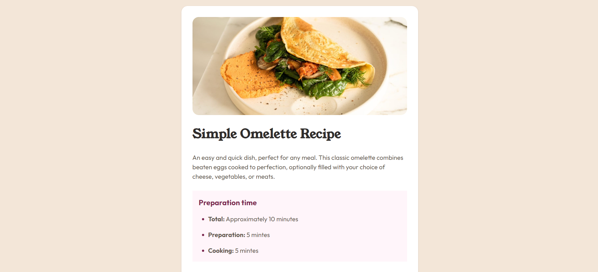

# Frontend Mentor - recipe page

This is a solution to the [recipe page](https://www.frontendmentor.io/challenges/recipe-page-KiTsR8QQKm).

- [Overview](#overview)
  - [The challenge](#the-challenge)
  - [Screenshot](#screenshot)
  - [Links](#links)
- [My process](#my-process)
  - [Built with](#built-with)
  - [What I learned](#what-i-learned)
  - [Continued development](#continued-development)
  - [Useful resources](#useful-resources)
- [Author](#author)
- [Acknowledgments](#acknowledgments)

## Overview

### The challenge

The challenge is to build a recipe page to show the ingrediants and instrubtions to make an omlett.

### Screenshot

### Links

- Solution URL: [Github](https://github.com/Mohammed-Nedjima/recipe-page-solution)
- Live Site URL: [Github pages](https://mohammed-nedjima.github.io/recipe-page-solution/)

## My process

### Built with

- Semantic HTML5 markup
- CSS custom properties
- CSS Flexbox
- Mobile-first workflow
- CSS grid

### What I learned

-Practice semantic Html elements
-Practice CSS custom properties

## Author

- Linkedin - [Mohammed Ayoub Nedjima](https://www.linkedin.com/in/mohammed-ayoub-nedjima//profile/kaamiik)
- Frontend Mentor: - [@Mohammed-Nedjima](https://www.frontendmentor.io/profile/Mohammed-Nedjima)
